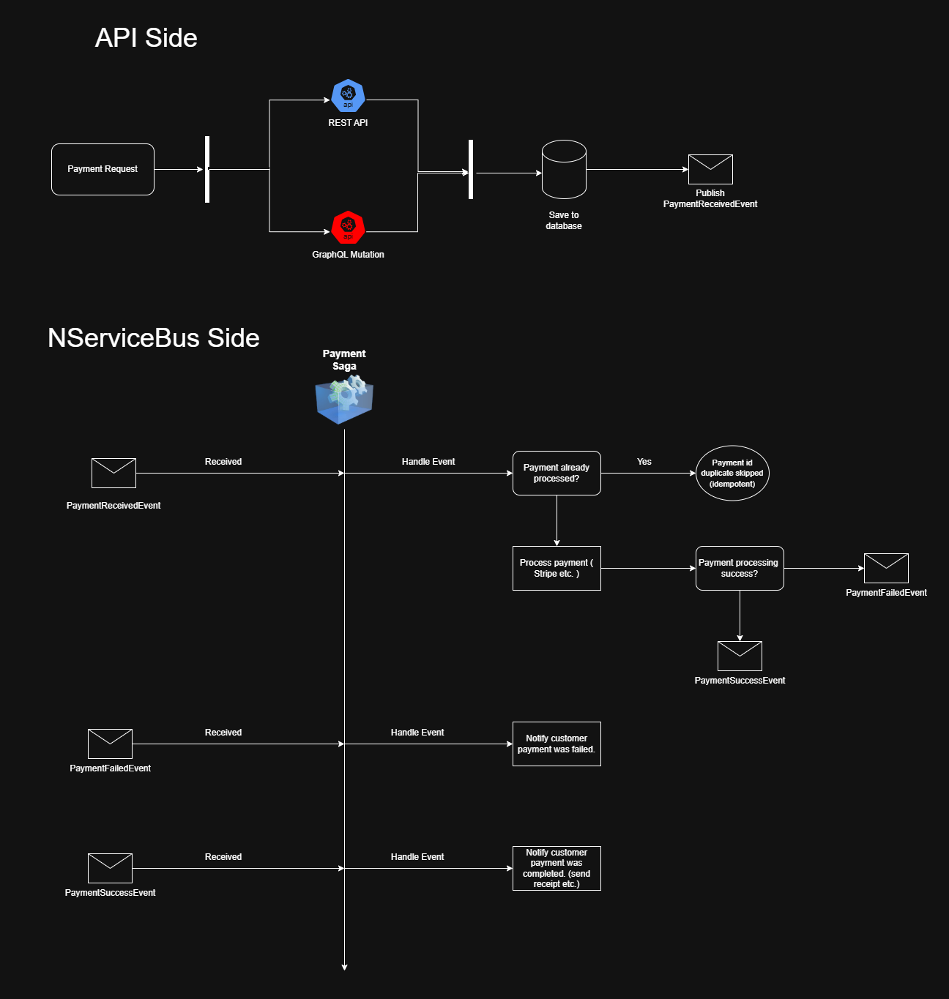
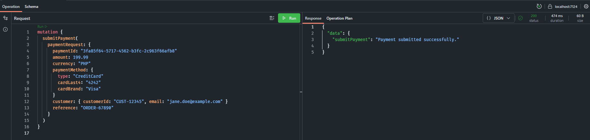
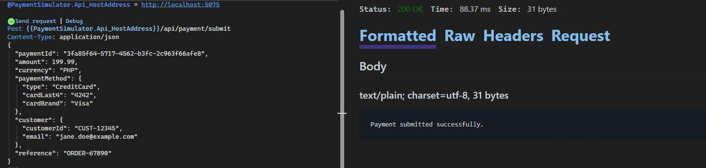

# Payment Simulator

## 🚀 Overview

**Payment Simulator** is a Proof of Concept (PoC) that demonstrates an event-driven payment processing system using **NServiceBus** and the **Saga pattern**.

The project simulates how modern distributed systems handle asynchronous payment workflows, including:

* Idempotent request handling
* Saga orchestration
* Event-driven communication
* Multiple entry points (REST API and GraphQL)

> ⚠️ This project intentionally simulates external systems (e.g., payment gateways and persistence) to focus on architectural patterns such as event-driven design and Saga orchestration.

---

## ▶️ How to Run

1. Run `PaymentSimulator.ServiceBus`
2. Run `PaymentSimulator.API`
3. Send request via REST or GraphQL
4. Observe console logs for event flow

---

## 💡 Why This Project

Modern payment systems are complex and rely heavily on asynchronous processing and distributed messaging.

This project was created to simulate how such systems work in practice, focusing on:
- Reliability (idempotency)
- Scalability (event-driven design)
- Maintainability (loose coupling)

---

## 🏗️ Architecture



The system is composed of two main parts:

### 1. API Layer (Entry Point)

* ASP.NET Web API
* GraphQL (Hot Chocolate)

Responsibilities:

* Accept payment requests
* Save to Database (simulated)
* Publish `PaymentReceivedEvent`

---

### 2. Messaging Layer (NServiceBus)

* Console application acting as message processor
* Uses **Saga** for orchestration

Responsibilities:

* Handle events asynchronously
* Ensure idempotency
* Simulate payment processing
* Publish success or failure events

---

## 🔄 Event Flow

```text
Client → API / GraphQL
       → Save to Database (simulated)
       → Publish PaymentReceivedEvent
       → Saga starts
       → Check idempotency
       → Simulate payment processing
           → Success → PaymentSuccessEvent
           → Failure → PaymentFailedEvent
       → Notify customer (simulated)
```

---

## 📌 Supported Events

* `PaymentReceivedEvent`
* `PaymentSuccessEvent`
* `PaymentFailedEvent`

---

## 💳 Sample Requests

### 🔹 GraphQL Mutation



```graphql
mutation SubmitPayment {
  submitPayment(
    paymentRequest: {
      paymentId: "3fa85f64-5717-4562-b3fc-2c963f66afb8"
      amount: 199.99
      currency: "PHP"
      paymentMethod: {
        type: "CreditCard"
        cardLast4: "4242"
        cardBrand: "Visa"
      }
      customer: {
        customerId: "CUST-12345"
        email: "jane.doe@example.com"
      }
      reference: "ORDER-67890"
    }
  )
}
```

---

### 🔹 REST API



**POST /api/payment/submit**

```json
{
  "paymentId": "3fa85f64-5717-4562-b3fc-2c963f66afe8",
  "amount": 199.99,
  "currency": "PHP",
  "paymentMethod": {
    "type": "CreditCard",
    "cardLast4": "4242",
    "cardBrand": "Visa"
  },
  "customer": {
    "customerId": "CUST-12345",
    "email": "jane.doe@example.com"
  },
  "reference": "ORDER-67890"
}
```

---

## 🔁 Idempotency

The system ensures that duplicate requests with the same `PaymentId` are not processed multiple times.

Example behavior:

```text
[3fa85f64-5717-4562-b3fc-2c963f66afe8] Duplicate request skipped (idempotent)
```

---

## ⚙️ Payment Processing (Simulated)

Instead of integrating real providers, the system simulates payment gateways such as:

* Credit Card (Stripe-like)

Processing includes:

* Artificial delay
* Random success/failure outcome
* Logging of results

---

## 🧠 Saga Responsibilities

The `PaymentSaga` is responsible for:

* Starting on `PaymentReceivedEvent`
* Tracking processing state
* Preventing duplicate execution
* Publishing:

  * `PaymentSuccessEvent`
  * `PaymentFailedEvent`
* Completing the workflow

---

## 📢 Post-Processing

### On Success:

* Mark payment as completed (simulated)
* Send receipt notification (simulated)

### On Failure:

* Mark payment as failed (simulated)
* Notify customer (simulated)

---

## 🖥️ Sample Console Output

```text
[3fa85f64-5717-4562-b3fc-2c963f66afe8] Payment received. Processing via Stripe (simulated)...
[3fa85f64-5717-4562-b3fc-2c963f66afe8] Stripe simulation SUCCESS for 199.99 PHP (Visa ****4242)
[3fa85f64-5717-4562-b3fc-2c963f66afe8] Payment successfully completed!
```

OR

```text
[3fa85f64-5717-4562-b3fc-2c963f66afe8] Payment received. Processing via Stripe (simulated)...
[3fa85f64-5717-4562-b3fc-2c963f66afe8] Stripe simulation FAILED: Insufficient funds
[3fa85f64-5717-4562-b3fc-2c963f66afe8] Payment failed: Insufficient funds
```

---

## 🛠️ Tech Stack

* .NET 10
* ASP.NET Web API
* GraphQL (Hot Chocolate)
* NServiceBus
* Saga Pattern
* LearningTransport

---

## 📦 Project Structure

```text
PaymentSimulator.sln
│
├── PaymentSimulator.API           # Web API + GraphQL
├── PaymentSimulator.ServiceBus    # NServiceBus handlers + Saga
└── PaymentSimulator.Events        # Events / Messages
```

---

## ⚠️ Disclaimer

This project intentionally simulates external systems such as payment gateways and data persistence.

The focus is on demonstrating architectural patterns including:
- Event-driven design
- Saga-based orchestration
- Idempotent message handling

No real payment processing or sensitive data is involved.

---

## 🎯 Purpose

This project demonstrates:

* Event-driven architecture
* Distributed system design principles
* Saga-based orchestration
* Idempotent message handling

---

## 👨‍💻 Author Notes

This project was built as a portfolio piece to showcase backend system design using modern .NET technologies and messaging patterns.
